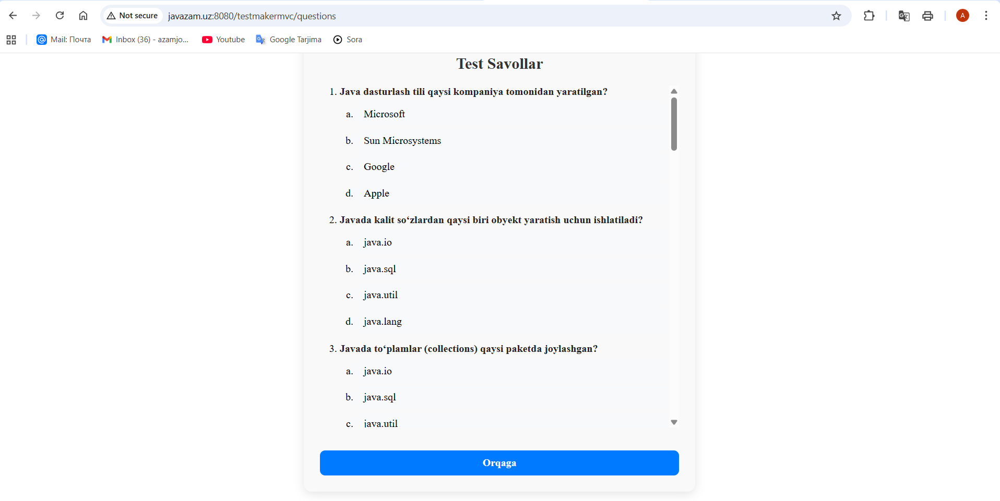
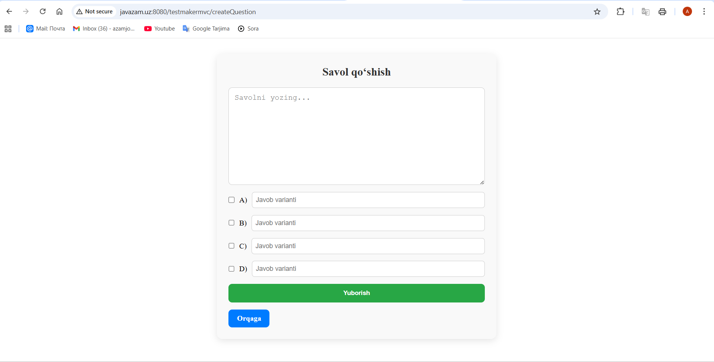
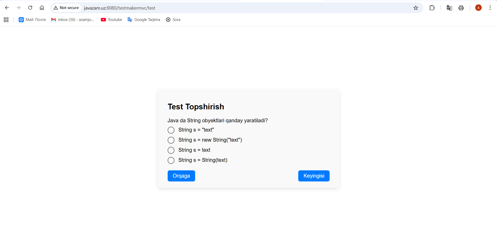

# testmakermvc project
**TestMakerMVC** — bu Java va Spring MVC yordamida ishlab chiqilgan veb-ilova bo‘lib, foydalanuvchilarga testlar topshirish, savollar qo‘shish va test natijalarni ko'rish imkonini beradi.  

Loyiha PostgreSQL bilan ishlaydi va MVC arxitekturasiga asoslangan.

🛠 Texnologiyalar: Java, Spring MVC, PostgreSQL, Thymeleaf

## Ishlatish

http://javazam.uz:8080/testmakermvc/ 

## Muallif
Azamjon Sobirov

## 🖼 Dastur oynasi

